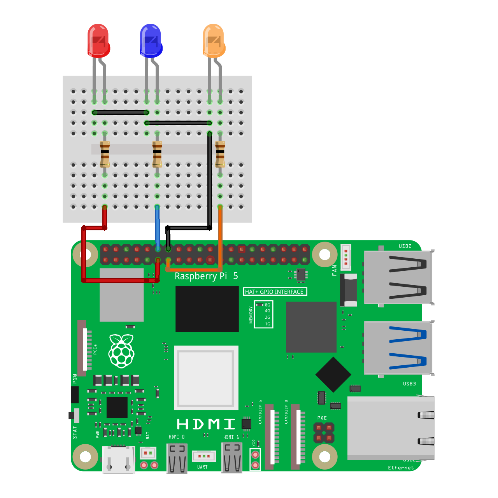

# rpi-playground / gpio

Since I have used Arduino microcontrollers in the past and have quite a bit of familarity with the Arduino ecosystem, I wanted to use the same Arduino methods to access Raspberry Pi's GPIO pins. I used the [**node-libgpiod**][LIB] library to do that in JavaScript.

Here is my attempt to implement `pinMode`, `digitalRead`, and `digitalWrite` methods using this library.

> [!IMPORTANT]
> Node.js **v20.15.1** is required.

## Sample Project

📌 [**Video demo here**](https://www.threads.net/@shadowshahriar/post/DH3fF9vSiRl)

### Code

```javascript
import { GPIO, digitalWrite, OUTPUT } from './lib.js'

// === initialize GPIO 17, 18, and 27 as OUTPUT ===
GPIO(17, OUTPUT)
GPIO(18, OUTPUT)
GPIO(27, OUTPUT)

let x = 0
let y = 0
let z = 0

setInterval(_ => digitalWrite(17, x++ % 2), 1000)
setInterval(_ => digitalWrite(18, y++ % 2), 700)
setInterval(_ => digitalWrite(27, z++ % 2), 400)
```

### Circuit Diagram



## Installation

Raspberry Pi OS is Debian based. So, [**according to the documentation**][DEBINS], we need to install the following dependencies:

```bash
sudo apt install gpiod libgpiod2 libgpiod-dev libnode-dev
```

Having done that, we need to install the NPM dependency by running:

```bash
npm i node-libgpiod
```

## Methods

### GPIO

Equivalent of `pinMode` of the Arduino ecosystem.

```typescript
const GPIO(pin: number, mode?: string, val?: number): void
```

| Parameter | Description                                                                                                                                                                                                                                                          |
| :-------- | :------------------------------------------------------------------------------------------------------------------------------------------------------------------------------------------------------------------------------------------------------------------- |
| `pin`     | Raspberry Pi's GPIO pin number. (see [**pinout.xyz**][PINOUT])                                                                                                                                                                                                       |
| `mode`    | Pin operation, can be either **INPUT** or **OUTPUT**.                                                                                                                                                                                                                |
| `val`     | 📌 When initialized as an **OUTPUT**, the `val` indicates the default value of the pin (**HIGH** or **LOW**).<br>📌 When initialized as an **INPUT**, the `val` can be optionally set to **INPUT_PULLUP** or **INPUT_PULLDOWN** to utilize those internal resistors. |

### purgeGPIO

Release the GPIO pin to free resources.

```typescript
const purgeGPIO(pin: number): boolean
```

| Parameter | Description                                                    |
| :-------- | :------------------------------------------------------------- |
| `pin`     | Raspberry Pi's GPIO pin number. (see [**pinout.xyz**][PINOUT]) |

According to the [**sample code**][SAMPLE], this is **NOT** needed as `libgpiod` releases resources on process exit.

### digitalRead

```typescript
const digitalRead(pin: number): number | null
```

| Parameter | Description                                                    |
| :-------- | :------------------------------------------------------------- |
| `pin`     | Raspberry Pi's GPIO pin number. (see [**pinout.xyz**][PINOUT]) |

### digitalWrite

```typescript
const digitalWrite(pin: number, val: number): boolean
```

| Parameter | Description                                                    |
| :-------- | :------------------------------------------------------------- |
| `pin`     | Raspberry Pi's GPIO pin number. (see [**pinout.xyz**][PINOUT]) |
| `val`     | Can be **HIGH** or **LOW**.                                    |

## Constants

| Constant           | Value    |
| :----------------- | :------- |
| **INPUT**          | "INPUT"  |
| **INPUT_PULLUP**   | 32       |
| **INPUT_PULLDOWN** | 16       |
| **OUTPUT**         | "OUTPUT" |
| **HIGH**           | 1        |
| **LOW**            | 0        |

<!-- links -->

[LIB]: https://github.com/sombriks/node-libgpiod
[DEBINS]: https://github.com/sombriks/node-libgpiod?tab=readme-ov-file#deb-based
[SAMPLE]: https://github.com/sombriks/node-libgpiod?tab=readme-ov-file#status
[PINOUT]: https://pinout.xyz/
