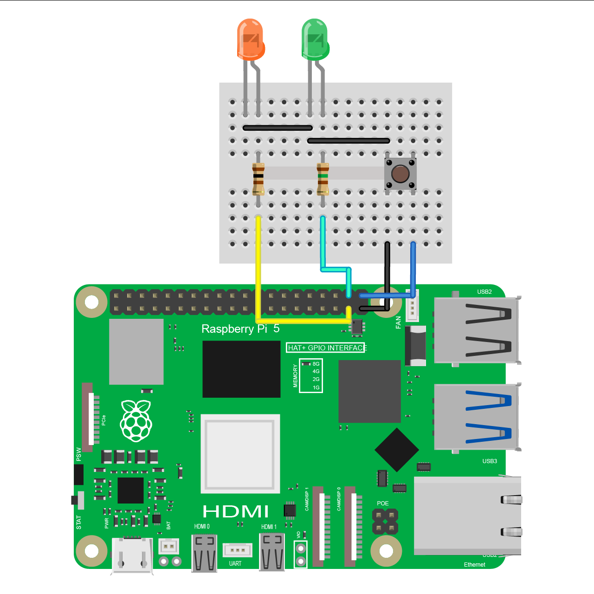

# rpi-playground / power-led-btn

Although Raspberry Pi 5 has a built-in power button and LED, their placement makes them harder to access if I integrate my Pi into a larger project. Plus, there are no GPIO pins available to access the power button or the LED directly.

> [!IMPORTANT]
> Tested on Python **v3.11.2**.

## Sample Project

📌 [**Video demo here**](https://www.threads.net/@shadowshahriar/post/DH4TjPBTZFd)

### Circuit Diagram



## Working Principle

We can unplug the power supply to turn the Raspberry Pi off, but that could potentially damage its storage. So, I thought it would be nice to implement my solution to shutdown the Raspberry Pi safely.

It includes two LEDs. The green LED indicates that the Pi has successfully booted up and is operational. Now, when I press the button, the Pi stops all services, and the orange LED turns on. The orange LED turns off when the Raspberry Pi is safely powered down, indicating it is okay to unplug the power supply.

I wrote a simple Python script that runs on startup and waits for an interrupt in one of Pi's GPIO pins. When that GPIO pin becomes low, the shutdown command is executed:

```bash
sudo shutdown -h now
```

## Installation

Run the following shell script:

```bash
/bin/sh ./02-power-led-btn/install
```

## Uninstallation

Run the following shell script:

```bash
/bin/sh ./02-power-led-btn/uninstall
```
