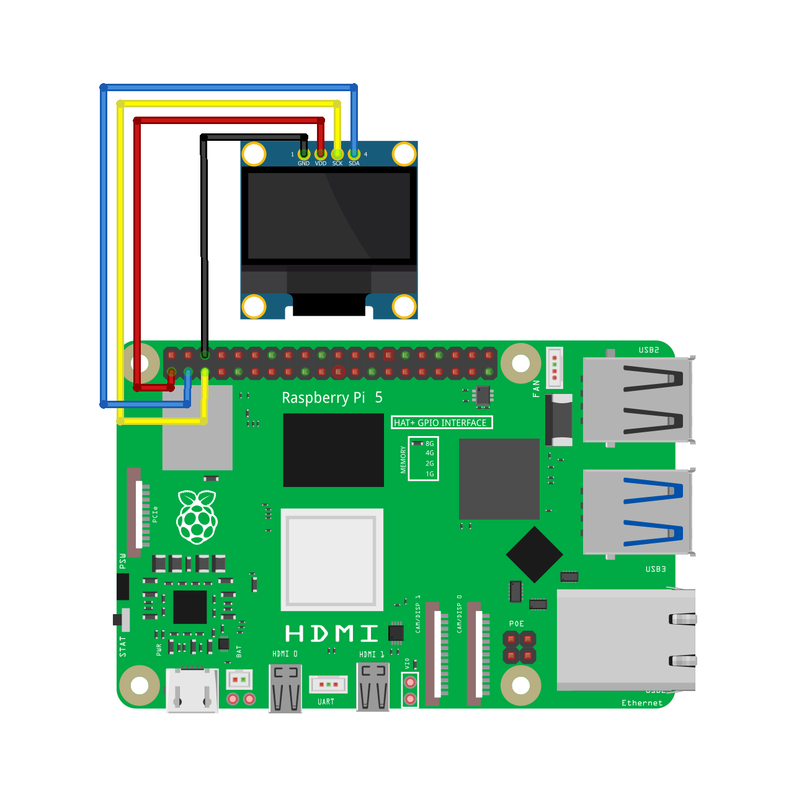

# rpi-playground / oled

We can do a lot of cool things with OLED displays. We can also control OLED displays using the I2C protocol on a Raspberry Pi 5. The [`oled-rpi-i2c-bus`](https://www.npmjs.com/package/oled-rpi-i2c-bus) npm library allows us to write English letters and strings using JavaScript. However, I wanted to write in OLED displays in my native language. So, I created this wrapper script to have this feature.

> [!IMPORTANT]
> Node.js **v20.15.1** is required.

## Demo Projects

[**📌 Basic Usage**](https://www.threads.net/@shadowshahriar/post/DH9CPjoS_cV)

[**📌 Advanced Usage (video demo)**](https://www.threads.net/@shadowshahriar/post/DICcwf-MjbD)

### Code

```javascript
import font from './fonts/font.org_v01_18px.js'
import { getOLED, renderText, drawFromCanvas, clearDisplay } from './lib.js'

async function main() {
	clearDisplay()
	renderText({
		str: 'わびさび',
		font: 'Noto Sans JP',
		bold: false,
		size: 25,
		lineHeight: 1.5,
		centerX: true,
		centerY: true,
		offsetY: -10
	})
	drawFromCanvas(64)

	const oled = getOLED()
	oled.setCursor(27, 42)
	oled.writeString(font, 1, 'WABI-SABI', 1, true)
}

main()
```

### Circuit Diagram



## Installation

First, we need to install the following dependencies:

```bash
sudo apt-get install i2c-tools libi2c-dev
```

Having done that, we need to install the required NPM dependencies by running:

```bash
npm i canvas i2c-bus oled-rpi-i2c-bus oled-font-5x7
```

## Methods

### renderText

```typescript
const renderText({
	str: string,
	font: string,
	size: number,
	bold?: boolean,
	tx: number,
	ty: number,
	lineHeight?: number,
	centerX?: boolean,
	centerY?: boolean,
	offsetY?: number
}): void
```

| Parameter    | Description                                                                      |
| :----------- | :------------------------------------------------------------------------------- |
| `str`        | Text that we want to display on the OLED display.                                |
| `font`       | Name of a font that is installed on the Raspberry Pi.                            |
| `size`       | Font size in pixels.                                                             |
| `bold`       | Boolean that determines whether we want to use bold fonts.                       |
| `tx`         | **x position** of the text.                                                      |
| `ty`         | **y position** of the text.                                                      |
| `lineHeight` | Line height of the text (default: **1.2**)                                       |
| `centerX`    | When `true`, the text will appear at the center of the display in the **x-axis** |
| `centerY`    | When `true`, the text will appear at the center of the display in the **y-axis** |
| `offsetY`    | Offset the text in the **y-axis** (in pixels)                                    |

### getCanvasData

```typescript
const getCanvasData(threshold?: number): Buffer<ArrayBuffer>
```

| Parameter   | Description                                             |
| :---------- | :------------------------------------------------------ |
| `threshold` | An integer in the range **[1, 255]** (default: **154**) |

### drawFromCanvas

```typescript
const drawFromCanvas(threshold?: number): void
```

| Parameter   | Description                                             |
| :---------- | :------------------------------------------------------ |
| `threshold` | An integer in the range **[1, 255]** (default: **154**) |

## Helper Functions

### clearDisplay

Clear the OLED display buffer, effectively making the screen black.

```typescript
const clearDisplay(): void
```

### clearCanvas

Fill the `node-canvas` instance with the background color (usually black).

```typescript
const clearCanvas(): void
```

### getOLED

Get the `Oled` instance.

```typescript
const getOLED(): Oled
```

### getCanvas

Get the `node-canvas` instance.

```typescript
const getCanvas(): Canvas
```

### getCtx

Get the `CanvasRenderingContext2D` instance created by the `node-canvas` instance.

```typescript
const getCtx(): CanvasRenderingContext2D
```

## Fonts

You can install the [`oled-font-pack`](https://www.npmjs.com/package/oled-font-pack) for an all-in-one font package:

```bash
npm i oled-font-pack
```

I also made a [**tool**](https://github.com/ShadowShahriar/oled-font-maker) to create custom fonts that work with the [`oled-rpi-i2c-bus`](https://www.npmjs.com/package/oled-rpi-i2c-bus) package.

[**📌 Try it here**](https://shadowshahriar.github.io/oled-font-maker/)

[**📌 Video demo here**](https://www.threads.net/@shadowshahriar/post/DIAWyMbS9K5)
